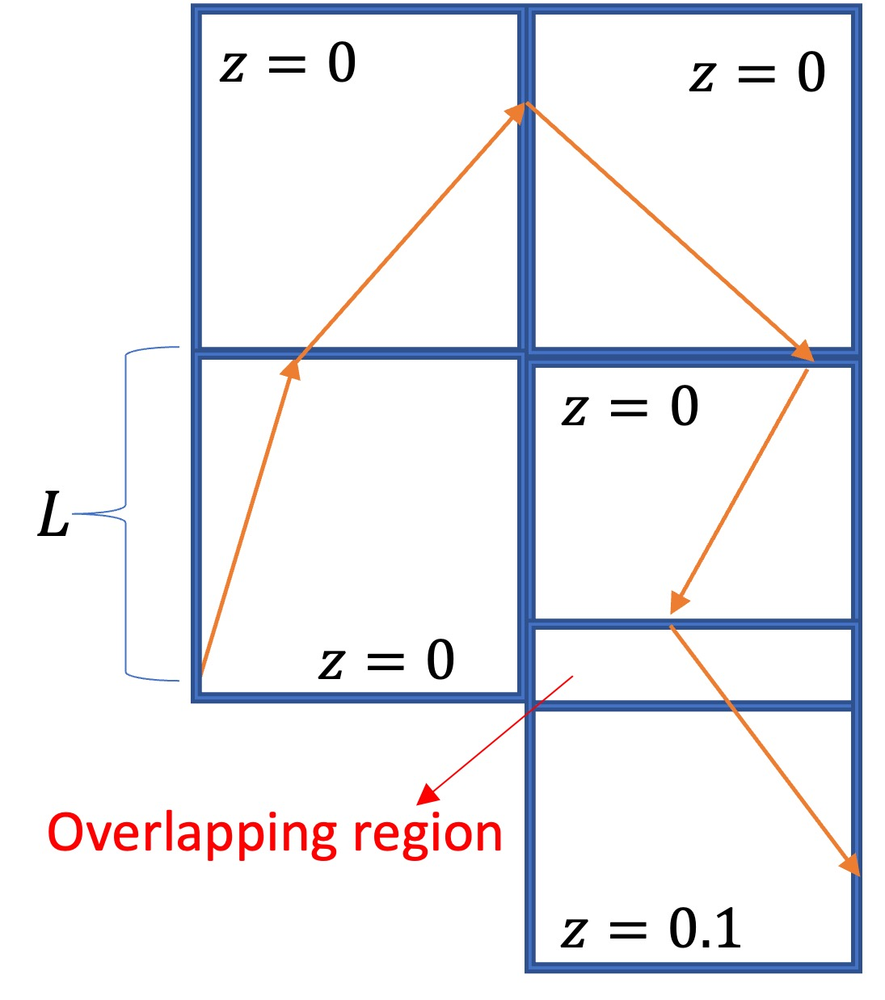
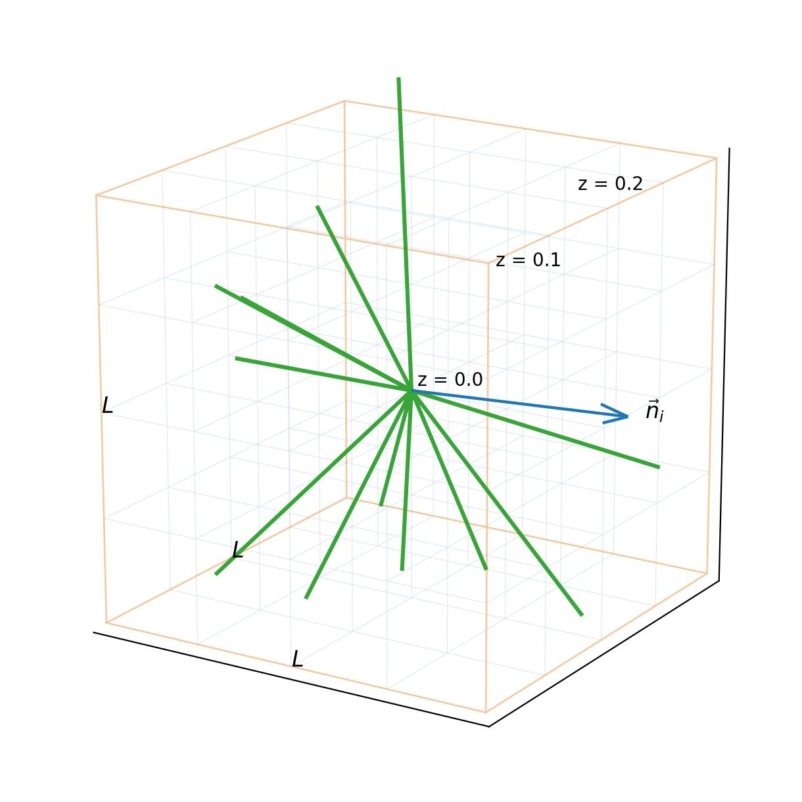

# FALCON (FRB Analysis & Light-cone COsmology on simulatioN)

This directory collects two complementary CROCODILE light-cone pipelines.

- `Gird_data_512_connection/`: the parallel rotating-LoS method, where a grid of parallel sightlines is connected across snapshots while the LoS orientation changes from box to box.
- `Ray_tracing/`: the box-stacking ray-tracing method, where one observer launches many sky directions through either fixed-orientation or randomly rotated shells.

## Method Schematics

**Figure 1. Parallel rotating-LoS geometry**

**Figure 2. Box-stacking ray-tracing geometry**

