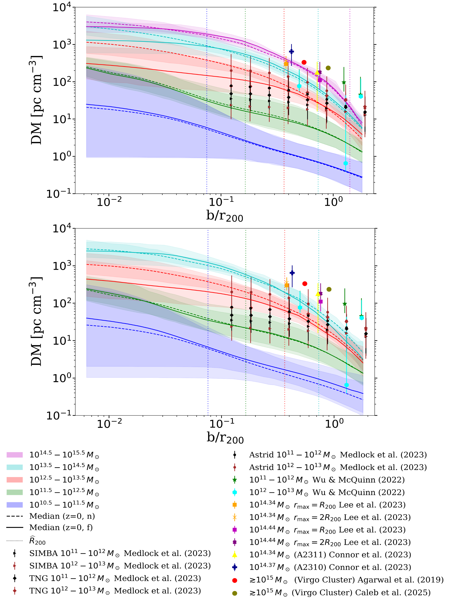
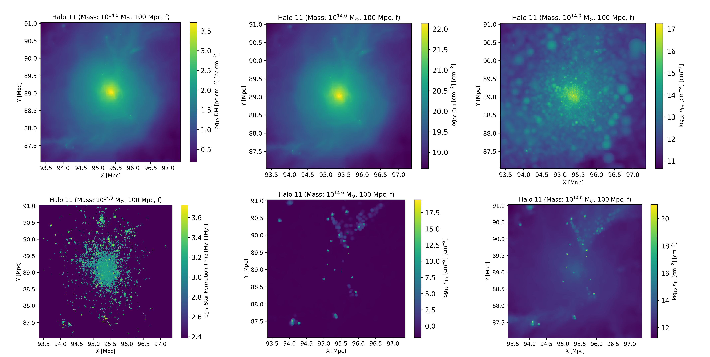

# Halo DM / CGM Analysis Pipeline

This pipeline is designed to extract local halo properties from large-scale simulation snapshots and FoF catalogues, and to perform a series of analyses including:

* Density profile computation and comparison
* DM vs. impact parameter analysis
* 1D sightline projection statistics
* 2D observer-style mapping and visualization

---

## Repository Structure

The current directory contains:

* `data_halo_storing_with_stellar_MPI_input.py`
* `density_profile_rv_morebins.py`
* `DM_Impact_factor_morebin.py`
* `Halo_DM_1D_map_joblib_withstellar.py`
* `Halo_DM_map_process_thread_P_joblib_observer_z.py`
* `run_halo_dm_pipeline.py`
* `config.yaml`

---

## Unified Runner

To avoid manually chaining commands, a lightweight unified execution layer is provided.

### Design Principles

* No modification to existing scientific scripts
* Centralized control of parameters, execution order, MPI configuration, and working directories

---

### Supported Steps

* `prepare`
* `density_profile`
* `dm_impact`
* `map1d`
* `map2d`
* `all`

---

### Dry Run

```bash
cd halo_dm_pipeline
python3 run_halo_dm_pipeline.py all --dry-run
```

This prints all commands without executing them.

---

### Run Single Step

```bash
python3 run_halo_dm_pipeline.py prepare
```

---

### Run Full Pipeline

```bash
python3 run_halo_dm_pipeline.py all
```

---

## Configuration File

Configuration is defined in:

```
config.yaml
```

### Structure

* `pipeline`:
  Controls Python executable, working directory, MPI launcher, number of processes, etc.

* `steps`:
  Controls whether each step is enabled, script selection, MPI usage, and arguments.

---

### Example Parameters

* `steps.prepare.args.snapshot_number`
* `steps.map1d.args.mass_range`
* `steps.map2d.args.snap_num`

---

### Notes

If `PyYAML` is installed:

* The runner reads `config.yaml` directly

Otherwise:

* Install `PyYAML`, or
* Convert config to JSON and pass via `--config`

---

## Workflow Overview

The recommended workflow is:

1. Data preparation
2. Density profile analysis
3. DM vs impact parameter analysis
4. 1D sightline projection
5. 2D observer-style mapping

---

## 1. Halo Local Data Extraction

Script:

```
data_halo_storing_with_stellar_MPI_input.py
```

### Function

* Reads snapshot and FoF catalogue data
* Extracts halo-centered local particle data
* Outputs structured HDF5 files

---

### Command

```bash
python data_halo_storing_with_stellar_MPI_input.py <snapshot_number>
```

Example:

```bash
python data_halo_storing_with_stellar_MPI_input.py 19
```

---

### Output Directory

```
/sqfs/work/.../Halo_data_2D/snap_<snapshot_number>
```

---

### Extracted Fields

#### Gas

* Density
* Temperature
* SmoothingLength
* StarFormationRate
* Metallicity
* HI, HII, H2I
* ElectronAbundance
* CELibOxygen, CELibIron

#### Dark Matter

* Coordinates
* Masses

#### Stellar

* Coordinates
* Masses
* Metallicity
* StellarFormationTime

#### FoF Halo

* GroupMass
* GroupPos
* Group_R_Crit200
* Group_M_Crit200
* Group_R_Mean200
* Group_M_Mean200

---

## 2. Density Profile Analysis

Script:

```
density_profile_rv_morebins.py
```

### Function

* Computes radial density profiles
* Supports multiple halo mass bins
* Compares different feedback models and box sizes
* Outputs profile curves with uncertainty bands
  
### Result Example

<p align="center">
  
</p>


---

## 3. DM vs Impact Parameter

Script:

```
DM_Impact_factor_morebin.py
```

### Function

* Computes DM along sightlines with varying impact parameter
* Probes CGM / halo gas distribution
* Produces DM vs ( b / R_{200} ) relations

---

### Result Example

<p align="center">
  
</p>

---

### Command

```bash
python DM_Impact_factor_morebin.py [a_] [h_] [Boxsize] [Boxname] [factor_RV]
```

---

## 4. 1D Sightline Projection

Script:

```
Halo_DM_1D_map_joblib_withstellar.py
```

### Function

* Projects halo properties along multiple 1D sightlines
* Computes:

  * DM
  * Stellar column density
  * Metallicity

---

### Method Illustration

<p align="center">
  
</p>


---

### Result Example

<p align="center">
  
</p>

---

### Features

* MPI + joblib parallelization
* Flexible radial binning
* Multiple HDF5 output modes

---

### Command

```bash
python Halo_DM_1D_map_joblib_withstellar.py <mass_range> <halo_num> \
    --snap-num N \
    --radial-bin-mode inner|uniform \
    --agn-info f|n|both \
    --h5-write-mode append|overwrite \
    --mpi-io-mode mpio|merge
```

---

## 5. 2D Observer-style Mapping

Script:

```
Halo_DM_map_process_thread_P_joblib_observer_z.py
```

### Function

* Generates 2D projected maps from an observer perspective
* Computes:

  * DM
  * Stellar mass
  * Star Formation Rate (SFR)
  * Metallicity
  * Stellar formation time (SFT)
  * Neutral hydrogen (HI)

---

### Method Illustration

<p align="center">
  
</p>

---

### Result Example

<p align="center">
  
</p>
---

### Command

```bash
python Halo_DM_map_process_thread_P_joblib_observer_z.py [snap_num] [feedback_on]
```

---

### Output Example

```
.../Halo_data_2D/snap_<snap_num>/DM_map_100f_observer/
.../Halo_data_2D/snap_<snap_num>/DM_map_100n_observer/
```

---

## Relationships Between Scripts

The pipeline structure is:

* `data_halo_storing_with_stellar_MPI_input.py` → upstream data preparation

* Downstream analysis:

  * `density_profile_rv_morebins.py`
  * `DM_Impact_factor_morebin.py`
  * `Halo_DM_1D_map_joblib_withstellar.py`
  * `Halo_DM_map_process_thread_P_joblib_observer_z.py`

---

### Summary

* First script → prepares dataset
* Remaining scripts → analyze the same dataset using different methods

---

## Figures

The project supports the following types of figures:

* Density profile plots
* Impact parameter geometry diagrams
* DM vs impact parameter results
* 1D sightline method diagrams
* 1D DM distribution results
* 2D mapping method diagrams
* 2D projected maps

---

### Figure Directory

```bash
halo_dm_pipeline/assets/
```

---

### Suggested Assets

```
assets/
├── density_profile_example.png
├── impact_parameter_geometry.png
├── impact_parameter_dm_result.png
├── oned_sightline_method.png
├── oned_dm_distribution_example.png
├── twod_mapping_method.png
├── twod_mapping_example.png
```

---

## Notes

* This pipeline is modular and non-intrusive
* Scientific scripts remain unchanged
* The runner only orchestrates execution

---

## Future Improvements

* Add automatic figure generation
* Integrate HEALPix-based sky projection
* Add angular correlation analysis for DM
* Extend to full light-cone simulations
